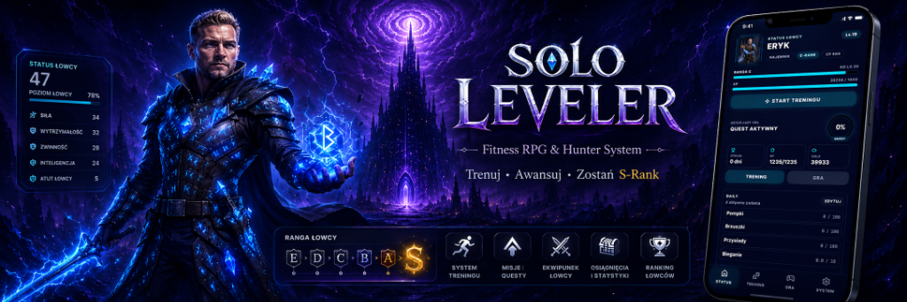

# ⚔️ Solo Leveler — Fitness RPG & Hunter System

  

  
  
  
  
  

---

**Solo Leveler** to aplikacja mobilna łącząca codzienny trening siłowy i biegowy z głęboką mechaniką gry RPG w klimacie Systemu Łowców. Zamień rzeczywisty wysiłek fizyczny w punkty doświadczenia, awansuj od **Rangi E** aż po potęgę **Rangi S**, wykonuj codzienne misje i mierz się z wyzwaniami w mini-grach oraz walkach Idle RPG.

Aplikacja działa w **100% offline**, nie wymaga zakładania konta, nie zawiera reklam i szanuje Twoją prywatność.

---

## 📥 Pobierz aplikację (Android)

Najnowszą paczkę instalacyjną pobierzesz bezpośrednio z oficjalnych wydań:

👉 **[Pobierz Solo Leveler APK (v1.2.0)](https://github.com/Dismonder/solo-leveler/releases/latest)**

---

## ✨ Kluczowe funkcje

### 🏋️‍♂️ 1. Trening & Śledzenie Powtórzeń w Czasie Rzeczywistym
* **Czujniki Ruchu (Akcelerometr + Żyroskop)**: Automatyczne zliczanie powtórzeń dla pompek, przysiadów i brzuszków bez dotykania ekranu.
* **Sesje treningowe w trybie poziomym i pionowym**: Ergonomiczny interfejs HUD z dużymi wskaźnikami tempa, powtórzeń i przerw.
* **Plany i Presety Łowcy**: Gotowe zestawy treningowe oraz możliwość tworzenia własnych rutyn.
* **Integracja Google Health Connect**: Przeliczanie przebytych kroków i dystansu na energię i EXP.

### 🎮 2. Mini-Gry Systemowe & Zręcznościowe
* **Cięcie Cienia (Shadow Strike)**: Przebudowany silnik Canvas 2D (<0.2 ms czasu renderowania) z obsługą 120 FPS i natychmiastowym dotykiem.
* **Unik Bramy (Gate Dodge)**: Dynamiczny test zręczności i refleksu w szczelinie wymiarowej.
* **Pamięć Many & Zamek Runów**: Łamigłówki sekwencji runicznych rozwijające koncentrację.
* **Ekstrakcja Cienia**: Mechanika ożywiania pokonanych cieni i pozyskiwania bonusów.

### 🐉 3. Moduł Walki Idle RPG
* Animowane areny walki z bossami i falami potworów.
* Zbieranie łupów, rzadkich artefaktów, kryształów i ulepszanie ekwipunku łowcy.
* Płynna optymalizacja renderowania klatek na GPU.

### 🎵 4. Zintegrowany Odtwarzacz & Muzyka
* Biblioteka 10 utworów w klimacie Solo Leveling.
* Niezależna, płynna regulacja głośności efektów dźwiękowych (SFX) i muzyki tła (OST).
* Działanie w tle podczas treningu.

### 🛡️ 5. Prywatność i Wydajność
* **Offline-First**: Wszystkie dane zapisywane są wyłącznie w pamięci Twojego telefonu.
* **Wymuszenie 120Hz**: Zoptymalizowany pod kątem ekranów o wysokim odświeżaniu (90Hz / 120Hz / 144Hz) dla maksymalnej responsywności.
* **Zero reklam i telemetrii**: Czysta gra bez zbędnych rozpraszaczy.

---

## 📱 Jak zainstalować na telefonie?

1. Pobierz plik `.apk` z zakładki **[Releases](https://github.com/Dismonder/solo-leveler/releases)** na swój smartfon.
2. Po pobraniu otwórz plik i zezwól przeglądarce / menedżerowi plików na *Instalowanie aplikacji z nieznanych źródeł* (standardowa procedura dla aplikacji spoza sklepu).
3. Zainstaluj i uruchom aplikację.
4. *(Opcjonalnie)*: W ustawieniach baterii telefonu wyłącz optymalizację baterii dla aplikacji, aby muzyka i powiadomienia o treningu działały niezawodnie w tle.

---

## 🔒 Polityka Prywatności

Szczegółowa polityka prywatności dostępna jest w dokumencie:
* 📄 **[Polityka Prywatności (Markdown)](PRIVACY_POLICY.md)**
* 🌐 **[Wersja WWW (HTML)](docs/privacy.html)**

---

## 📄 Licencja & Zastrzeżenia

Projekt stworzony jako niezależna, niekomercyjna aplikacja fitnessowa i gra z motywem łowców (Fan-Made / Indie). Wszelkie motywy artystyczne stanowią hołd dla gatunku i nie są powiązane z oficjalnymi wydawcami komercyjnymi.
